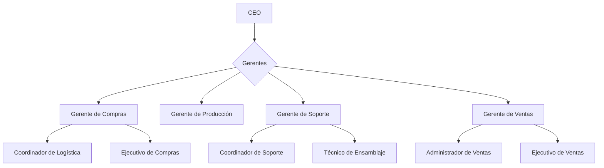

# ConstruFurgo S.A.S. - Organigrama

## Estructura Jerárquica

 

## Configuración de Divisas y Datos de la Empresa en Salesforce para ConstruFurgo S.A.S.

Este documento resume los cambios realizados para la implementación de la empresa ConstruFurgo S.A.S. en Salesforce, enfocándose en los resultados obtenidos.

## 1. Actualización de la Información de la Empresa

* Se ha actualizado la información básica de la organización en Salesforce. Los datos clave incluyen:
    * Nombre de la organización: ConstruFurgo S.A.S.
    * Dirección principal: Av. Boyacá #12-33, Bogotá, Colombia.
    * Configuración regional: Español (Colombia).
    * Zona horaria: (GMT-05:00) Colombia Standard Time (America/Bogota).
* Estos cambios aseguran que la información de la empresa en Salesforce refleje la realidad de ConstruFurgo S.A.S.

### 1.1. Creación de la Cuenta y Contacto

* Se creó una cuenta en Salesforce con la siguiente información:
    * Razón Social: ConstruFurgo S.A.S.
    * Número de Identificación Tributaria (NIT): 901456789-2.
    * Domicilio Principal: Av. Boyacá #12-33, Bogotá, Colombia.
    * Annual Revenue: $5,000,000 USD.
    * Industry: Diseño, fabricación, comercialización y mantenimiento de furgones industriales.
    * SIC Code: 456789 como registro mercantil
* Se creó un contacto asociado a la cuenta ConstruFurgo S.A.S.:
    * Nombre: Juan Pérez López
    * Email: contacto@construfurgo.com
    * Se designo a Juan perez Lopez como representante legal de la empresa.
* Estos registros permiten gestionar la información de la empresa y su representante legal de manera efectiva.

## 2. Configuración de Divisas

1.  **Activación de Divisas:**
    * **2.1** Se han activado las divisas **USD (Dólar Estadounidense)** y **COP (Peso Colombiano)**.

2.  **Habilitación para Usuarios:**
    * **2.2** Esto permite que los usuarios de ConstruFurgo S.A.S. puedan registrar transacciones y oportunidades en ambas divisas.

3.  **Configuración Inicial:**
    * **2.3** Se ha configurado la tasa de conversión inicial entre USD y COP.
    * **2.4** Se han establecido los decimales correspondientes a cada moneda.

4.  **Gestión Avanzada de Divisas:**
    * **2.5** Se ha habilitado la función de **Gestión Avanzada de Divisas** en la organización de Salesforce.
    * **2.6** Esto permite el seguimiento y la actualización diaria de la tasa de cambio (TRM) entre USD y COP.
    * **2.7** Las oportunidades en Salesforce reflejarán los valores convertidos según la TRM del día.

## 3. Visualización de Oportunidades en COP y USD

* Las oportunidades en Salesforce ahora pueden mostrar montos en USD y COP.
* Las conversiones entre divisas se realizan automáticamente, utilizando la TRM actualizada.
* Los informes y paneles pueden mostrar datos financieros en ambas divisas.

## Resultado

Con estos cambios, ConstruFurgo S.A.S. ahora tiene un entorno de Salesforce configurado para manejar transacciones en múltiples divisas y reflejar la tasa de cambio diaria, asegurando la precisión de los datos financieros.

 
 

## Configuración de Roles en Salesforce para ConstruFurgo S.A.S.

Este apartado describe la configuración de roles personalizada para ConstruFurgo S.A.S. en Salesforce, incluyendo la eliminación de roles predeterminados y la implementación de una estructura jerárquica específica.

## 1. Eliminación de Roles Predeterminados

* Se han eliminado los roles predeterminados proporcionados por Salesforce.
* Esto permite una configuración de roles completamente personalizada, adaptada a la estructura organizativa de ConstruFurgo S.A.S.

## 2. Estructura de Roles Personalizada

### 2.1 Descripción de Roles y Dependencias

| **Rol**                     | **Descripción**                                                                                              | **Dependencias**                          |
|-----------------------------|--------------------------------------------------------------------------------------------------------------|-------------------------------------------|
| **CEO**                      | Máxima autoridad de la empresa. Responsable de la dirección estratégica y la toma de decisiones clave. Supervisa directamente a los Gerentes. | -                                         |
| **GERENTE DE COMPRAS**       | Responsable de la adquisición de materiales y servicios necesarios para la producción. Supervisa al Coordinador de Logística y al Ejecutivo de Compras. | Rinde cuentas al CEO.                    |
| **Coordinador de Logística** | Responsable de la gestión de la cadena de suministro y la logística de la empresa.                           | Rinde cuentas al **GERENTE DE COMPRAS**.      |
| **Ejecutivo de Compras**     | Responsable de la ejecución de las compras y la gestión de proveedores.                                      | Rinde cuentas al **GERENTE DE COMPRAS**.      |
| **GERENTE DE PRODUCCIÓN**    | Responsable de la planificación y ejecución de la producción. Supervisa directamente a los Técnicos de Ensamblaje. | Rinde cuentas al CEO.                    |
| **GERENTE DE SOPORTE**       | Responsable de la gestión del soporte técnico y el mantenimiento de equipos. Supervisa al Coordinador de Soporte y a los técnicos de ensamblaje. | Rinde cuentas al CEO.                    |
| **Coordinador de Soporte**   | Responsable de coordinar las actividades de soporte técnico.                                                | Rinde cuentas al **GERENTE DE SOPORTE**.     |
| **Técnico de Ensamblaje**    | Responsable del ensamblaje y mantenimiento de los productos.                                                 | Rinde cuentas al **GERENTE DE SOPORTE**.     |
| **GERENTE DE VENTAS**        | Responsable de la planificación y ejecución de las estrategias de ventas. Supervisa al Administrador de Ventas y al Ejecutivo de Ventas. | Rinde cuentas al CEO.                    |
| **Administrador de Ventas**  | Responsable de la gestión de las operaciones de ventas y el seguimiento de clientes.                        | Rinde cuentas al **GERENTE DE VENTAS**.      |
| **Ejecutivo de Ventas**      | Responsable de la ejecución de las ventas y la atención al cliente.                                          | Rinde cuentas al **GERENTE DE VENTAS**. |

 

## Creación de Usuarios y Perfiles

Se han creado los siguientes perfiles y usuarios en la organización de Salesforce:

### Perfiles Creados

| Nombre del Perfil            | Departamento ideal            | Basado en Licencia de Usuario |
| :--------------------------- | :------------------------- | :----------------------------- |
| Production Manager   | Producción      | Salesforce Platform User        |
| Sales Manager        | Ventas          | Salesforce Platform User        |
| Procurement Specialist | Compras         | Salesforce Platform User        |
| Technical Support    | Soporte         | Standard User                 |

### Usuarios Creados

* **carlosperez@CPwhiteconstrufurgo.com**
    * Rol: Gerente de Producción (Production Manager)
* **mariagomez@MGblueconstrufurgo.com**
    * Rol: Gerente de Ventas (Sales Manager)
* **anamartinez@AMpinkconstrufurgo.com**
    * Rol: Gerente de Compras (Procurement Specialist)
* **gabrielleon@GLredconstrufurgo.com**
    * Rol: Gerente de Soporte (System Administrator)
* **manuelparedes@MPgrayconstrufurgo.com**
    * Rol: CEO (Usuario Estándar)

Estos usuarios serán ideales para validar la correcta implementación de la organización construfurgo S.A.S. en Salesforce

## Beneficios de la Configuración Personalizada

* La estructura de roles personalizada refleja la organización real de ConstruFurgo S.A.S.
* Facilita la asignación de permisos y el control de acceso a datos en Salesforce.
* Mejora la eficiencia y la claridad en la gestión de la empresa.

 
 

# Importación de Datos CSV con Data Loader

## Account

1.  **Creación de Campo Personalizado:**
    * Se creó un campo personalizado llamado `id_cuenta` en el objeto `Account`.
    * Este campo se configuró como tipo "Texto (ID externo)" y se marcó como "Único" e "ID externo" para permitir su uso como campo de búsqueda (lookup) en Data Loader.
2.  **Imagen de Configuración:**

    

## Lead

1.  **Inserción de Registros:**
    * Se insertaron 100 registros en el objeto `Lead` utilizando Data Loader.

## Contact

1.  **Inserción de Registros:**
    * Se insertaron registros en el objeto `Contact` utilizando Data Loader.
2.  **Imagen de inserción:**
    

## Cases

1.  **Inserción de Registros:**
    * Se insertaron 100 registros en el objeto `Cases` utilizando Data Loader.

## Oportunidades

1.  **Modificación del Archivo CSV:**
    * Se modificó el archivo CSV para incluir una columna `Close Date` (Fecha de Cierre).
    * Este campo es obligatorio para la creación de registros de `Opportunity`.
2.  **Inserción de Registros:**
    * Se insertaron los registros de `Opportunity` utilizando Data Loader, incluyendo la columna `Close Date`.

# Configuración de Carpetas de Informes por Departamento y Permisos de Acceso

## Introducción

Este documento describe la configuración de carpetas de informes compartidas para cada departamento de la compañía y los permisos de acceso asignados a cada una, incluyendo la creación de subcarpetas confidenciales para el CEO y el gerente del departamento.

## Carpetas de Departamentos y Permisos de Acceso

* **Ventas:**
    * Nombre de la carpeta: `equipo_ventas`
    * Permisos:
        * Rol "CEO": Acceso "Ver" (View)
        * Rol "Administrador de Ventas": Acceso "Ver" (View)
        * Rol "Ejecutivo de Ventas": Acceso "Ver" (View)
    * Subcarpeta Confidencial: `reportes_gerencia`
        * Permisos:
            * Rol "CEO": Acceso "Administrar" (Manage)
            * Rol "Gerente de Ventas": Acceso "Administrar" (Manage)

* **Soporte:**
    * Nombre de la carpeta: `equipo_soporte`
    * Permisos:
        * Rol "CEO": Acceso "Ver" (View)
        * Rol "Técnico de Ensamblaje": Acceso "Ver" (View)
        * Rol "Coordinador de Soporte": Acceso "Ver" (View)
    * Subcarpeta Confidencial: `reportes_gerencia`
        * Permisos:
            * Rol "CEO": Acceso "Administrar" (Manage)
            * Rol "Coordinador de Soporte": Acceso "Administrar" (Manage)

* **Compras:**
    * Nombre de la carpeta: `equipo_compras`
    * Permisos:
        * Rol "CEO": Acceso "Ver" (View)
        * Rol "Gerente de Compras": Acceso "Ver" (View)
        * Rol "Ejecutivo de Compras": Acceso "Ver" (View)
    * Subcarpeta Confidencial: `reportes_gerencia`
        * Permisos:
            * Rol "CEO": Acceso "Administrar" (Manage)
            * Rol "Gerente de Compras": Acceso "Administrar" (Manage)

 
 

# Reportes y Dashboards de la organización

## Informes y Dashboard de Ventas para el Departamento de Ventas

## Informes de Ventas

Se crearon los siguientes informes para el departamento de ventas:

1.  **Oportunidades Abiertas:**
    * Informe que muestra las oportunidades que aún no se han cerrado.

    

2.  **Oportunidades Perdidas:**
    * Informe que muestra las oportunidades que se han cerrado como perdidas.

    

3.  **Oportunidades Ganadas:**
    * Informe que muestra solo las oportunidades que se han cerrado como ganadas.

    

## Dashboard de Ventas

* Se creó un dashboard que incluye los tres informes anteriores para proporcionar una visión general del estado de las oportunidades de ventas.
* El dashboard es accesible solo para el CEO y el Gerente de Ventas, mediante la configuración de permisos adecuados.

 
 

# Informes y Dashboard de Casos para el Departamento de Soporte

## Informes de Casos

Se crearon los siguientes informes para el departamento de soporte:

1.  **Casos Abiertos:**
    * Informe que muestra los casos que aún no se han cerrado.
    * Imagen del reporte:
        

2.  **Casos Cerrados:**
    * Informe que muestra los casos que se han cerrado.
    * Imagen del reporte:
        

3.  **Medios de Apertura de Casos:**
    * Informe que muestra los diferentes medios por los cuales se abren los casos (por ejemplo, correo electrónico, teléfono, portal web).
    * Imagen del reporte:
        

## Dashboard de Casos

* Se creó un dashboard que incluye los tres informes anteriores para proporcionar una visión general del estado de los casos de soporte.
* El dashboard es accesible solo para el CEO y el Gerente de Soporte, mediante la configuración de permisos adecuados.
* Imagen del dashboard:
    

 
 

# Implementación de Soluciones Personalizadas para cada Departamento de la organización

## Departamentos y Aplicaciones Especializadas

Se han implementado soluciones personalizadas para los siguientes departamentos:

### 1. Ventas

* **Aplicación:** Aplicación de Ventas

    
* **Funcionalidades:**
    * Gestión centralizada de oportunidades y leads.
    * Gestión de compradores y órdenes de compra.
    * Dashboard interactivo con cotizaciones enviadas y pendientes.
    * Registro de actividad comercial y reuniones con clientes.
* **Roles con Acceso:**
    * CEO
    * Gerente de Ventas
    * Administrador de Ventas
    * Ejecutivo de Ventas
* **Vista Personalizada en Leads:**
    * Se ha creado una vista personalizada llamada "Leads que no han sido contactados" para facilitar el trabajo del equipo de ventas.

    

### 2. Producción

* **Aplicación:** Aplicación de Producción

    
* **Funcionalidades:**
    * Gestión de órdenes de producción.
    * Seguimiento de inventario de materias primas y productos terminados.
    * Programación de la producción.
    * Control de calidad.
* **Roles con Acceso:**
    * CEO
    * Gerente de Producción

### 3. Soporte

* **Aplicación:** Aplicación de Soporte

    

* **Funcionalidades:**
    * Gestión de casos de soporte.
    * Seguimiento de tickets.
    * Base de conocimientos.
    * Informes de rendimiento del equipo de soporte.
* **Roles con Acceso:**
    * CEO
    * Gerente de Soporte
    * Coordinador de Soporte
    * Técnico de Ensamblaje

## Consideraciones Importantes

* **Acceso Exclusivo:** Cada aplicación es accesible únicamente por los miembros del departamento correspondiente, garantizando la seguridad y privacidad de la información.
* **Personalización:** Las aplicaciones están personalizadas para satisfacer las necesidades específicas de cada departamento, optimizando los procesos y la productividad.
* **Vistas Personalizadas:** Se crean vistas personalizadas en los objetos relevantes para facilitar el trabajo de los usuarios, como la vista "Leads que no han sido contactados" en el departamento de ventas.

## Validación de Correos Electrónicos en Leads y Contactos

Se ha implementado una regla de validación para los campos de correo electrónico en los objetos de "Lead" y "Contacto", previniendo la creación de registros con correos inválidos que podrían afectar negativamente las oportunidades de negocio futuras.

Se validan los siguientes aspectos de una dirección de correo electrónico:

* **Parte local (antes de la "@"):**
    * Permite caracteres alfanuméricos (a-z, A-Z, 0-9).
    * Permite los siguientes caracteres especiales: punto (.), guión bajo (_), porcentaje (%), signo más (+), y guión (-).
* **Símbolo "@":**
    * Asegura que la dirección contenga el símbolo "@".
* **Nombre de dominio:**
    * Permite caracteres alfanuméricos y guiones (-).
    * Permite subdominios opcionales.
* **Dominio de nivel superior (TLD):**
    * Asegura que el TLD contenga al menos dos letras.
    * Ejemplos de TLDs validos: .com, .net, .org, .co

**Nombre de la regla de validación:** `Validacion_correo`

**Importancia:**

* Reduce el riesgo de enviar correos electrónicos a direcciones inválidas.
* Optimiza la comunicación con clientes potenciales y contactos.

## Validación de Números de Teléfono en Contactos, Leads y Cuentas

Se ha implementado una regla de validación en los campos de números de teléfono de los objetos "Contacto", "Lead" y "Cuenta". Asegurando que los números de teléfono sigan el formato internacional estándar.

Exige que los números de teléfono cumplan con el siguiente formato:

* **"+" (Signo más):** El número debe comenzar con el signo "+", indicando una llamada internacional.
* **Código de país:** Después del "+", debe haber un código de país de 1 a 3 dígitos.
* **Número local:** El resto del número de teléfono puede contener cualquier cantidad de dígitos.

**Nombre de la regla de validación:** `Validacion_telefono`

**Importancia:**

* Reduce el riesgo de errores al marcar números de teléfono.
* Facilita la integración con sistemas de telefonía y otras aplicaciones.

## Implementación de Reglas de Coincidencia y Duplicados para Leads, Contactos y Cuentas

Se han implementado reglas de coincidencia y duplicados para prevenir la creación de registros duplicados en los objetos Lead, Contacto y Cuenta, asegurando la integridad de los datos.

### Reglas de Coincidencia (Matching Rules)

#### 1. Regla de Coincidencia para Contactos

* **Objeto:** Contacto
* **Descripción:** Comparamos nombres, apellidos y dirección similares. Email exacto.
* **Criterios de Coincidencia:**
    * Apellido: Coincidencia aproximada. 
    * Nombre: Coincidencia aproximada.
    * Dirección (MailingStreet): Coincidencia aproximada.
    * Correo Electrónico: Coincidencia exacta.

#### 2. Regla de Coincidencia para Leads

* **Objeto:** Lead
* **Descripción:** Comparamos nombres y apellidos similares, email exacto y que el nombre de la compañía sea similar.
* **Criterios de Coincidencia:**
    * Nombre: Coincidencia aproximada.
    * Apellido: Coincidencia aproximada .
    * Correo Electrónico: Coincidencia exacta.
    * Compañía: Coincidencia aproximada.

#### 3. Regla de Coincidencia para Cuentas

* **Objeto:** Cuenta
* **Descripción:** Comparamos coincidencias parciales en nombre de cuenta, dirección, exactitud en numero de cuenta, tipo y telefono.
* **Criterios de Coincidencia:**
    * Nombre de la Cuenta: Coincidencia aproximada.
    * Dirección: Coincidencia aproximada.
    * Numero de Cuenta: Coincidencia exacta.
    * Tipo: Coincidencia exacta.
    * Telefono: Coincidencia exacta.

### Reglas de Duplicados (Duplicate Rules)

| Objeto  | Nombre de la Regla          | Seguridad a Nivel de Registro                               | Acción a Ejecutar                                                               | Regla de Coincidencia |
| :------ | :-------------------------- | :----------------------------------------------------------- | :------------------------------------------------------------------------------ | :-------------------- |
| Lead    | Duplicate rule block leads  | Compara sólo los registros a los que el usuario tiene acceso. | Bloquear la creación y edición si se encuentran coincidencias parciales. | leads\_duplicados     |
| Contacto | Duplicate rule block contacts | Compara sólo los registros a los que el usuario tiene acceso. | Bloquear la creación y edición si se encuentran coincidencias parciales. | contactos duplicados  |
| Cuenta  | Duplicate rule block accounts | Compara sólo los registros a los que el usuario tiene acceso. | Bloquear la creación y edición si se encuentran coincidencias parciales. | cuentas\_duplicadas   |

 

# Creación de un mecanismo de respaldo y recuperación de datos

* **Respaldo Automático Diario:**
    * Se ha configurado la función de "Exportación de Datos" de Salesforce para realizar respaldos automáticos cada 24 horas.
    * Esta exportación incluye todos los datos de la organización, incluyendo:
        * Registros de objetos estándar y personalizados.
        * Imágenes, documentos y archivos.
    * Los archivos de respaldo se generan en formato CSV y se almacenan en un servidor seguro.
* **Respaldo Mensual Completo:**
    * Adicionalmente, se genera un archivo de respaldo completo al final de cada mes, a las 2:00 AM.
    * Este archivo contiene una copia consolidada de todos los datos respaldados durante el mes.
    * El archivo mensual se envía automáticamente al Administrador de Salesforce por correo electrónico.
* **Restauración de Datos:**
    * La restauración de datos solo puede ser realizada por el Administrador de Salesforce.
    * El Administrador utilizará la herramienta "Data Loader" o "Workbench" para importar los datos desde los archivos de respaldo.
    * Se ha establecido un protocolo de restauración que incluye:
        * Verificación de la integridad de los archivos de respaldo.
        * Pruebas de restauración en un entorno sandbox antes de la restauración en producción.
        * Documentación detallada del proceso de restauración.

 
 

# Auditorías de Inicio de Sesión de Usuarios

## Introducción

Este documento describe la generación de un reporte de auditoría de inicios de sesión de usuarios de la organización, que se actualiza mensualmente y se envía automáticamente al CEO.

## Reporte de Auditoría de Inicios de Sesión

* Se genera un reporte de auditoría que registra los inicios de sesión de los usuarios en la organización.
* El reporte incluye información como:
    * Nombre de usuario.
    * Fecha y hora del inicio de sesión.
    * Dirección IP desde la que se inició la sesión.
    * Dispositivo utilizado para el inicio de sesión.
    * Resultado del inicio de sesión (éxito o fallo).
* El reporte se actualiza automáticamente cada 30 días.
* El CEO está suscrito al reporte y lo recibe automáticamente por correo electrónico cada mes.

## Configuración

* La generación del reporte y la suscripción del CEO se configuran en la sección de informes y dashboards de Salesforce.
* Se utiliza el tipo de informe "Historial de inicio de sesión" para crear el reporte de auditoría.
* Se programa la actualización del reporte para que se ejecute mensualmente.
* Se configura la suscripción del CEO al reporte, especificando la frecuencia de envío (mensual) y el formato del correo electrónico.

 

## Políticas de Contraseñas (Password Policies)

* Se implementaron políticas de contraseñas para garantizar la seguridad de las credenciales de los usuarios.
* Las políticas incluyen los siguientes requisitos:
    * Longitud mínima de la contraseña.
    * Complejidad de la contraseña (combinación de letras, números y caracteres especiales).
    * Expiración de la contraseña y necesidad de cambio periódico.
    * Historial de contraseñas para evitar la reutilización.
* Estas políticas se aplican a todos los usuarios de la organización.

## Seguimiento del Historial de Datos (History Tracking)

* Se activó el seguimiento del historial de datos en los objetos "Oportunidades" y "Cuentas".
* El seguimiento del historial permite registrar los cambios realizados en campos críticos de estos objetos.
* Esto proporciona una pista de auditoría para el seguimiento de cambios importantes y la identificación de posibles problemas.
* Los campos críticos que se rastrean incluyen:
    * Monto de la oportunidad.
    * Etapa de la oportunidad.
    * Nombre de la cuenta.
    * Dirección de la cuenta.
* El historial de cambios se almacena y se puede consultar para fines de auditoría y análisis.

 

# Flujos y procesos automatizados

##  Asignación Automática de Leads: Notificación al Gerente de Ventas

Se ha implementado la notificación automática al Gerente de Ventas mediante la creación de un Flow, un Email Template y un Email Alert.

* **Flow (Flujo):**
    * El Flow se activa cuando se crea un nuevo registro de Lead.
    * El Flow utiliza un Email Alert para enviar una notificación al Gerente de Ventas.

* **Email Template (Plantilla de Correo Electrónico):**
    * Se ha creado una plantilla de correo electrónico personalizada para la notificación.
    * La plantilla incluye información relevante del Lead, como el nombre, la empresa y el asunto.

* **Email Alert (Alerta de Correo Electrónico):**
    * Se ha creado un Email Alert que utiliza la plantilla de correo electrónico creada.
    * El Email Alert se configura para enviar el correo electrónico al usuario obtenido por el Flow, que es el Gerente de Ventas.
    * El Email Alert se activa desde el Flow cuando se crea un nuevo Lead.

## Imagen de ejemplo

## Conversión Automática de Lead a Oportunidad

Se ha implementado la conversión automática de Lead a Oportunidad mediante la creación de un Flow activado por registros en el objeto Lead.

* **Flow (Flujo):**
    * El Flow se activa cuando se crea o actualiza una tarea.
    * El Flow obtiene las interacciones del Lead.
    * Si el Lead tiene menos de 3 interacciones, se actualiza el registro del Lead.
    * Si el Lead tiene 3 interacciones, se convierte automáticamente en una Oportunidad.
    * se establece una condición para dejar de iterar las interacciones cuando ya es una oportunidad.
    * Si la conversión a Oportunidad es exitosa, se genera automáticamente una propuesta comercial.

## Notificación al Gerente de Soporte por Caso Crítico

Se ha implementado la notificación al Gerente de Soporte cuando se crea un Caso Crítico mediante la creación de un Flow activado por registros en el objeto Caso.

* **Flow (Flujo):**
    * El Flow se activa cuando se crea un nuevo registro de Caso.
    * El Flow verifica si el Caso es Crítico.
    * Si el Caso es Crítico, se envía una Alerta de Correo Electrónico al Gerente de Soporte.

## Imagen de ejemplo

 

## Envío de Factura al Cerrar Oportunidad Ganada

Se ha implementado el envío automático de factura al cerrar una oportunidad como ganada mediante la creación de un Flow activado por registros en el objeto Oportunidad.

* **Flow (Flujo):**
    * El Flow se activa cuando se actualiza un registro de Oportunidad y la etapa cambia a "Cerrado Ganado".
    * El Flow genera una factura.
    * El Flow obtiene el contacto asociado a la oportunidad.
    * Si el contacto está disponible y tiene correo electrónico, se envía la factura al contacto.
    * Si el contacto no está disponible o no tiene correo electrónico, se verifica si la cuenta asociada tiene correo electrónico.
    * Si la cuenta tiene correo electrónico, se envía la factura al correo electrónico de la cuenta.
    * Si la cuenta no tiene correo electrónico, se envía la factura al usuario que atiende la oportunidad.
    * Se realiza una prueba de envío al administrador.

## Imagen de ejemplo

## Proceso de Verificación

1.  **Descarga de Salesforce Mobile:**
    * Se descargó la aplicación Salesforce Mobile desde la tienda de aplicaciones correspondiente (App Store o Google Play).

2.  **Inicio de Sesión:**
    * Se inició sesión en la aplicación Salesforce Mobile utilizando las credenciales del usuario Gerente de Ventas.

3.  **Verificación de Aplicaciones Disponibles:**
    * Se verificó que la única aplicación disponible para el usuario Gerente de Ventas fuera la aplicación de ventas.
    * Se comprobó que no se mostraran otras aplicaciones, como las de soporte, producción o compras.

4.  **Navegación en la Aplicación de Ventas:**
    * Se navegó por las diferentes secciones de la aplicación de ventas para verificar que todas las funcionalidades estuvieran accesibles para el Gerente de Ventas.
    * Se comprobó el acceso a oportunidades, leads, contactos, cuentas y otras funcionalidades relevantes.

## Imagen de Ejemplo

 
